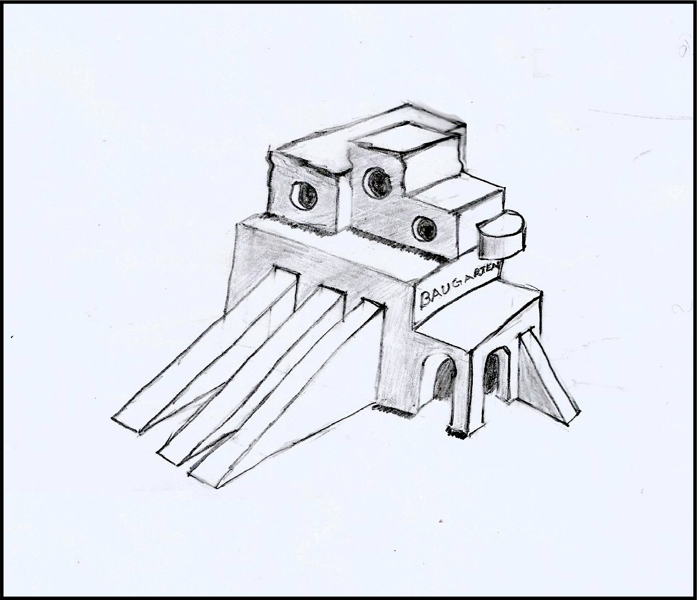
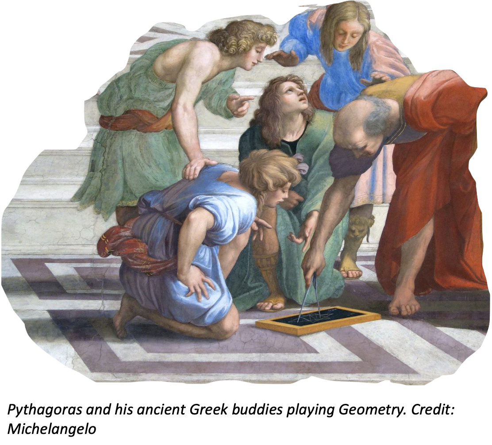

<blockquote>
Im Mittelpunkt aller besonderen Arten der Tätigkeit nämlich steht der Mensch, der ohne alle, auf irgendetwas Einzelnes gerichtet Absicht, nur die Kräfte seiner Natur stärken und erhöhen, seinen Wesen Wert und Dauer verschaffen will. Da jedoch die bloße Kraft einen Gegenstand braucht, an dem sie sich üben, und die bloße Form, der reine Gedanke, einen Stoff, in dem sie, sich darin ausprägend, fortdauern könne, so bedarf der Mensch einer Welt außer sich. Daher entspringt sein Streben, den Kreis seiner Erkenntnisse und seiner Wirksamkeit zu erweitern.
 

 — Wilhelm von Humboldt, <em>Theorie der Bildung des Menschen</em>, 1794 

<a href="#translation">English Translation</a>
</blockquote>

 
What is Baugarten?
 
 
We’ve all seen the Zoom calls: burnt-out teachers talking at empty ‘I deactivated my laptop camera’ ovals. Behind each oval — slumped alone on a sofa — is a teenage student. Is his mind on his math teacher’s whiteboard of crooked symbols?
 
 
Now is the time to change the way we teach math. Baugarten is the world’s first real-time strategy game to teach algebra and geometry. What does that mean?
 
 
Picture a computer game for you to create a farm. Your field’s empty. You want to plant tomatoes. You click on the market, but you don’t know how many seeds to buy. You take a guess, plant a few, and two minutes later your farm’s first crop arrives. Weeds pockmark big wasted patches. Whoops y-daisy. You bought too few seeds. You click to pay the cost to rip out the weeds and sell your scanty crop. Now curiosity sprouts from your disappointment. How can you skip the weeds and harvest more tomatoes next time?
 
 

 
No feeling is more natural to humans than the felicitous laziness that causes us to ask, “How can I do that easier next time?” Like Athena bursting from Zeus’s skull, all of our inventive marvels are the offspring of this slacker question. Keen to bag a bigger harvest, you look around for an easier way.
 
 

 
In the corner of the game is a toolkit. It’s a box of formulas shaped like farm fields. You ignored it at first because, who clicks on formulas? You hate formulas. Math intimidates you. But now you notice a triangle formula for calculating seeds by finding the area. You activate the tool and you calculate your field’s area, revealing like a magic spell how many seeds to buy.
 
 

 
All fun in games is one of two forms: discovery and mastery. The fun of discovery is learning the world of a game. The fun of mastery is learning how to advance your interests by overcoming an obstacle. Even the most violent or wildly time-sucking games are fun because your gameplay is built on one of these two forms of learning. Games and learning are so entwined that players of every hit game create web forums to learn tricks for mastery. Discovering or mastering, games are fun because you learn.
 
 

 

 
Each piece of a geometry or algebra equation in our game is a field, a seed, a tractor, a fence — a visual metaphor in the world of your farm. The secret to Baugarten is that the game never forces you to do math. Instead, algebra and geometry are your tricks for mastery. You naturally discover the power of these formula tools because they win your farm bigger pickings and advance your mastery over Baugarten’s world. Baugarten connects meaning to geometry by showing you its footprint on your farm. Without area equations, you incur waste buying too many seeds. Without Pythagoras’ theorem, wild boars eat your cabbages because you bought too little wood for fences. As your farm grows, the formulas grow on you. You discover that they are your tools, your allies and your friends. Geometry is the algebra of space, and space is the constraint and resource of every farm. Application of these simple formulas to your fields and fences hatches curiosity. Curiosity grows into satisfaction that you planted the right number of seeds. Satisfaction ripens into a feeling of power and mastery as your farm bustles with the activity spawned by your cleverness.
 
 
<h4>Aren’t there lots of math games? Why is Baugarten different?</h4>

 
Existing math games are puzzles or adventures. These games create artificial clots that force you to stop playing unless you solve math equations. I call these games “homework with lipstick on.” Kids have a great nose for sniffing out homework. Homework isn’t fun.
 
 
Baugarten, by contrast, is a world-building “real-time strategy” (RTS) game. In RTS games you build farms, cities and empires while you manage constrained resources. SimCity, Age of Empires and Factorium are RTS games. One RTS game, FarmVille, is arguably the world’s most widely played game of all time, with over one billion installations.
 
 
Baugarten is the first RTS game in which algebra and geometry are your tools. Unlike the puzzle and adventure games, Baugarten’s RTS experience never stops your play until you do your homework. It charms you into using algebra and geometry as a toolkit to to more advantageously manage your farm’s constrained resources.
 
 

 
<h4>Why does the world need this game?</h4>
 
The Institut für Qualitative Bildung (IQB) reports that German math scores in the last six years slumped to a 25% failure rate at the “minimum math level required for the middle school certificate (MSA).” A study of US community colleges finds that 75% of college students fail their required algebra class. In Baltimore, one Baugarten founders’ native city, a 2017 public analysis concluded that 1 in 3 high schools have zero students proficient in math. Economist Andrew Hacker writes that “the main impediment” for “all who embark on higher education” of whom “only 58% end up with degrees” is “freshman math.” As “the major academic reason” for the 25% of Americans who never finish high school “most educators I speak to,” writes Dr. Hacker, “cite algebra.”
 
 
This stuff matters because, as students’ algebra skills tank, algebra’s latent benefits skyrocket. Geometry and algebra are the ‘kick-off gun’ to the problem-solving skills that start a child on the Olympic dash to booming new professions like IT. They are the invisible nuts and bolts inside solutions to global engineering challenges like green energy. The scratching of a child’s pencil is the beginning of every skyscraper. In its 2020 request for new scalable solutions to education, the world’s biggest startup accelerator, Y Combinator, writes “a small increase in the learning output of education systems across the globe would have an enormous impact on human productivity and economic growth.”
 
 
It’s hard for a teenager to imagine and feel that memorizing symbolic logic abstractions touches his or her life. Even before cell phones and corona, how vital did geometry and algebra feel to all your classmates in your childhood?
 
 
Baugarten’s central question is, ‘How can we make learning math intrinsically exciting for intellectually curious students?’ How can we help teachers show that this knowledge is fun because it’s powerful — that formulas advance my ability as a student to shape the world around me — first in the world of Baugarten the game, and later in the real world?
 
 
Imagine coming to school the day after playing your homework, Baugarten. Last night, as your farm buzzed with growth, you impressed your dad by adjusting your tractor with a formula for its angle. Now a teacher pulls out a Baugarten curriculum for angles. A spark of recognition lights in your mind. You used that formula for your tractor last night. This stuff clicks. 
 
 
Baugarten is for German students in the 7th grade, when they are about 13 years old. It is for students in the US in 8th, 9th and 10th grade, depending on the state. Baugarten, however, will also be fun for parents to play, as well as for younger children playfully exploring.
 
 
<h4>How is this all going to happen?</h4>
Patience, grit, the game engine Unity, two software engineer-entrepreneurs, one with six years experience developing applications and the sale of one startup (RateMyStudyAbroad) already under his belt — the other with two years of Unity programming under his belt - and playful creativity: these are Baugarten’s first ingredients. The creative participation of students, pedagogues and game designers will be key to Baugarten’s success. The most important element behind the game will be the people and culture of the firm behind it, SketchKraft GmbH. SketchKraft the company will be a profitable “Leonardo DaVinci’s workshop” of creative tinkerers. 
 
 
The game engine Unity has emerged in recent years as a powerful graphical user interface, mixed with C# coding, for game development. Like combining lego blocks, we will build Baugarten’s first prototype, a mobile game, from an existing Unity RTS latticework.
 
 
<h4>Education games aren’t fun. Yours won’t be either.</h4>
The hardest part about education games is making learning fun. As soon as you see an equation, you see homework.
Think of the most fun games. You are delighted to discover a new way of doing things. You find that your farm, your settlement and your workers operate more effectively. They can build more stuff. They are more automated and require less of your concentration to perform ever more activities. That is the feeling you get as you discover the power of formulas in Baugarten.
 
 
<h4>Baugarten's Wider Horizons</h4>
 

 
The Coronavirus has changed education’s relationship to technology forever. It’s time to explore new horizons of learning math that go beyond the structure of school.
 
 
The ancient Greek writer Plutarch calls education not the filling of a pale, but the lighting of a fire. Baugarten fires exploration of algebra and geometry by connecting it to a feeling of growing mastery over an RTS farm world. And Baugarten’s later iterations will go further. With, for example, windmills that teach Newtonian physics, we’ll expand the world to include settlements and cities teaching knowledge of other STEM (Science, Technology, Math) skills.
 
 
The ancient Greek word for ‘relaxed fun’ is <em>scholé</em>. From the language of math’s playful ancient Greek inventors we derive our word, school. Baugarten returns mathematical learning to its ancient Greek roots in fun. It links the satisfaction of algebraic problem-solving with real-time strategy gameplay. 
 
 
Baugarten puts the <em>scholé</em> back in school.
 
 

 

<blockquote>
At the center hub of all different kinds of activity stands the human being, who, in the absence of a particular direction, wants only to strengthen and heighten the powers of his nature — to obtain worth and duration for his living being. As, however, sheer power needs an object on which it may exercise itself, and naked form or pure idea a material, upon which it can impress itself and last, so too does man need a world outside of himself. From there springs his endeavor to expand the sphere of his knowledge and activity.
 
 
— Wilhelm von Humboldt, Theory of Human Education, 1794
</blockquote>

