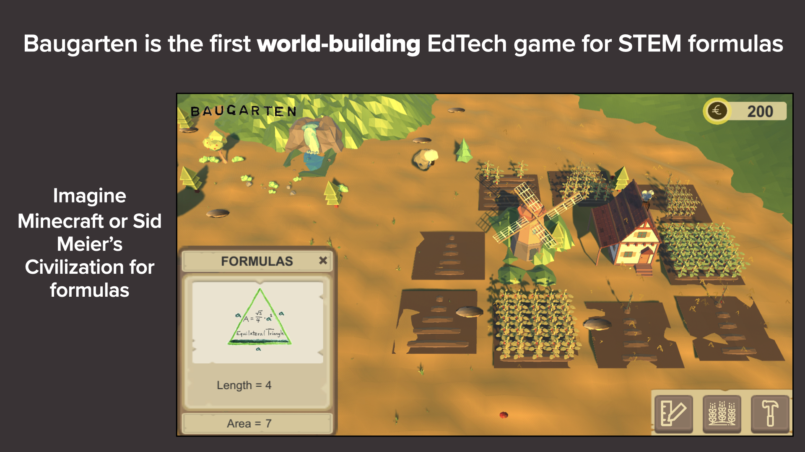
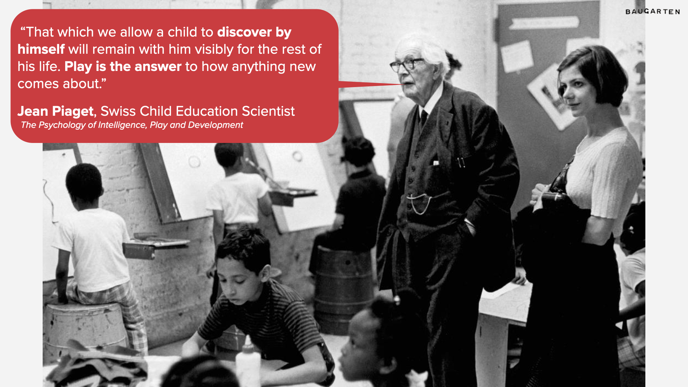
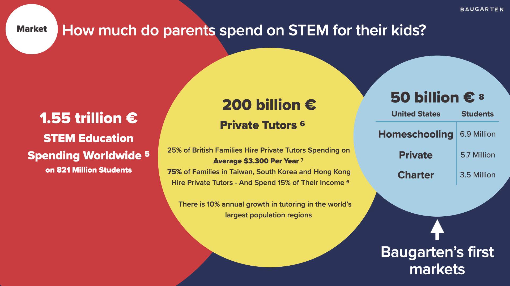

<iframe src="https://player.vimeo.com/video/674874714?h=f6cd7ffc3f&amp;badge=0&amp;autopause=0&amp;player_id=0&amp;app_id=58479" frameborder="0" allow="autoplay; fullscreen; picture-in-picture" allowfullscreen style="position:absolute;top:0;left:0;width:100%;height:100%;" title="Baugarten: The World-Building Game That Teaches STEM Formulas"></iframe>

* * *

# Baugarten: The World-Building Game for STEM Formulas

Baugarten is the first world-building EdTech game for STEM formulas. Imagine Minecraft or Sid Meier's Civilization for formulas. Playing Baugarten you discover that formulas are tools to manage your resources and build your city. 
* * *
## [Read the Essay That Started The Project](essay)

 

 

 

* * *

### Are you a student, a teacher, a gamer, or just someone who finds our project exciting? 
#### We'd love to hear from you.

##### <a href="mailto: henry@baugarten.app">henry@baugarten.app</a>
* +49 0176 473 89 458
 
 
* Kreuzberg, Berlin
* 10965, Deutschland
 
